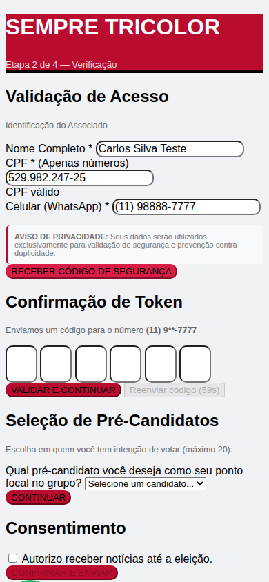
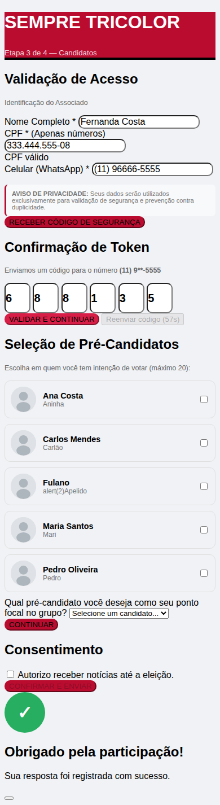
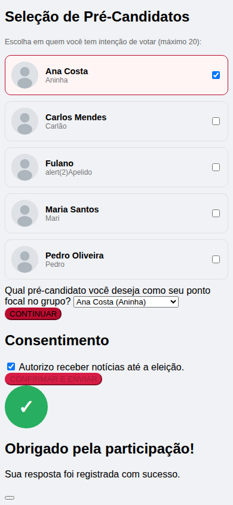

# Sondagem de Intenção de Votos

Aplicação web mobile-first para sondagem de intenção de votos entre os
associados de um clube esportivo, com validação de CPF, autenticação por
OTP via SMS e painel administrativo.

Construída sob contrato para o **Sempre Tricolor** (São Paulo) e em
produção em `sempretricolor.org`. Este repositório é a versão de
portfólio: o código é o mesmo, e acompanha um ambiente de demonstração
com dados 100% fictícios que sobe com dois comandos.

<p align="center">
  
  
  
  
</p>

## Ver rodando em 2 minutos

Requer Docker. Nenhuma credencial externa é necessária — o ambiente de
demonstração não envia SMS de verdade nem valida reCAPTCHA.

```bash
docker compose -f docker-compose.demo.yml up -d --build
docker compose -f docker-compose.demo.yml exec app alembic upgrade head
docker compose -f docker-compose.demo.yml exec app python -m scripts.seed_demo
```

- Sondagem: <http://localhost:8080>
- Painel: <http://localhost:8080/admin> — `admin` / `demo1234`
- API: <http://localhost:8080/api/docs>

O código do OTP não é enviado por SMS na demo; ele aparece no log:

```bash
docker compose -f docker-compose.demo.yml logs -f app | grep "OTP mock"
```

Detalhes em [docs/DEMO.md](docs/DEMO.md). **Todos os dados da demo são
inventados** — nenhum CPF, nome, telefone ou voto corresponde a pessoa
real.

## O problema

Um clube com milhares de associados precisava medir intenção de voto
antes da eleição da diretoria. O link circula por WhatsApp, quase todo
mundo responde pelo celular, e o resultado só vale se cada sócio contar
uma vez — sem cadastro prévio, sem senha, sem app para instalar.

Daí as três restrições que moldaram o sistema: **identidade verificável
sem cadastro** (CPF + OTP no celular), **um voto por pessoa** (unicidade
de CPF, número de sócio e telefone) e **mobile-first de verdade**, porque
o desktop é a exceção.

## Fluxo

1. **Cadastro** — nome, CPF com validação de dígito verificador em tempo real, número de sócio, celular e declaração de titular do grupo familiar
2. **OTP** — código de 6 dígitos por SMS, com expiração e cooldown em Redis
3. **Candidatos** — seleção múltipla, até 20
4. **Ponto focal** — escolha única entre os candidatos marcados na etapa anterior
5. **Modalidades** — departamentos que o sócio frequenta, com campo livre em "Outros"
6. **LGPD** — consentimento antes do envio

## Stack

Python 3.12 · FastAPI · SQLAlchemy 2 (async) · PostgreSQL 16 · Redis 7 ·
Alembic · Bootstrap 5 · Docker Compose · Nginx

Sem framework de frontend: o fluxo é uma página só com JavaScript puro,
porque a página precisa abrir rápido em 4G e a complexidade não
justificaria o bundle.

## Decisões que valem uma olhada

Algumas escolhas do projeto não são óbvias, e o código explica o porquê
no lugar em que a decisão vive:

**Rate limit por IP não funciona quando o link circula por WhatsApp.**
Operadoras colocam milhares de assinantes atrás do mesmo IP público
(CGNAT). Com o limite apertado, sócios legítimos começam a se bloquear
entre si, enquanto um atacante real troca de IP de graça — o limite
punia exatamente quem não era o alvo. A proteção principal passou a ser
o que não depende de IP: cooldown por telefone, unicidade de CPF checada
antes de gastar SMS, e reCAPTCHA que falha fechado.
[`app/core/config.py`](app/core/config.py)

**`numero_socio` é texto, não inteiro.** Zeros à esquerda são
significativos: `0042` e `42` são sócios diferentes.
[`app/models/__init__.py`](app/models/__init__.py)

**`titular` é nullable de propósito.** `NULL` significa "não perguntado",
e é o que fica nas respostas coletadas antes de a pergunta existir. Um
default `False` na migration transformaria todo mundo que já respondeu em
"não titular" — uma resposta que ninguém deu.
[`app/models/__init__.py`](app/models/__init__.py)

**As modalidades têm ordem explícita, não `ORDER BY nome`.** A collation
do banco ordena "Volei Masculino" longe dos outros dois "Vôlei", e o
resultado varia entre ambientes. A ordem é um dado, não efeito colateral
de configuração.
[`alembic/versions/006_add_departamentos.py`](alembic/versions/006_add_departamentos.py)

**O provider de OTP de desenvolvimento se recusa a rodar fora de debug.**
Ele loga o código em texto puro — é essa a utilidade dele. Se alguém
subir para produção com `OTP_PROVIDER=mock` por engano, é melhor falhar
alto na primeira tentativa do que descobrir depois que nenhum SMS saiu e
todos os códigos foram parar no log.
[`app/integrations/otp_providers.py`](app/integrations/otp_providers.py)

**Upload de foto valida magic bytes, não a extensão.** Qualquer arquivo
pode ser renomeado para `.png`.
[`app/services/admin_service.py`](app/services/admin_service.py)

## Segurança

- Validação matemática de CPF (dígitos verificadores)
- Um voto por CPF, por número de sócio e por telefone
- OTP em Redis: expiração de 5 min, 5 tentativas, cooldown de 60s por telefone
- Google reCAPTCHA v3, com falha fechada fora de debug
- Rate limiting por rota (SlowAPI), configurável por variável de ambiente
- Headers de segurança: CSP, X-Frame-Options, HSTS
- Sanitização de entrada com Bleach, contra XSS armazenado
- Senha do admin em hash bcrypt — a aplicação recusa iniciar em produção se não for
- Cookie de sessão `httponly` + `samesite=strict`, com token CSRF à parte
- CPF nunca aparece em log de aplicação (mascarado)
- Logs de auditoria dos eventos sensíveis

## Estrutura

```
app/
├── api/routes/     # Rotas REST (público e admin)
├── core/           # Config, segurança, rate limiting, logging
├── database/       # Sessão SQLAlchemy async
├── integrations/   # Providers de OTP (Twilio, Zenvia, Z-API, Vonage, mock), reCAPTCHA
├── middlewares/    # Headers de segurança, request id
├── models/         # Modelos ORM
├── repositories/   # Acesso a dados
├── schemas/        # Schemas Pydantic
├── services/       # Regras de negócio
└── utils/          # CPF, telefone, número de sócio, OTP, sanitização
```

## Testes

A suíte roda em container: ela precisa de PostgreSQL e Redis de verdade,
não de mocks, e do Python 3.12 do projeto.

```bash
docker compose -f docker-compose.demo.yml up -d db redis
docker build -f Dockerfile.test -t sondagem-test:latest .
docker run --rm --network sondagem-demo_default -v "$PWD:/app" -w /app \
  -e DATABASE_URL="postgresql+asyncpg://demo:demo@db:5432/sondagem_test" \
  -e DATABASE_URL_SYNC="postgresql+psycopg2://demo:demo@db:5432/sondagem_test" \
  -e REDIS_URL="redis://:demo@redis:6379/1" \
  sondagem-test:latest pytest -q
```

O `Dockerfile.test` monta o código em `/app` em vez de copiar, para editar
no host refletir no container sem reconstruir a imagem. Ver
[docs/DEPENDENCIAS.md](docs/DEPENDENCIAS.md).

## Documentação

- [Ambiente de demonstração](docs/DEMO.md)
- [Instalação](docs/INSTALACAO.md)
- [API](docs/API.md)
- [Deploy](docs/DEPLOY.md) · [Checklist de produção](docs/PRODUCAO.md)
- [Teste de carga](docs/TESTE_DE_CARGA.md)

## Licença

Software proprietário, desenvolvido sob contrato. O código está publicado
para fins de portfólio e avaliação técnica — não há licença de uso,
cópia ou redistribuição.
